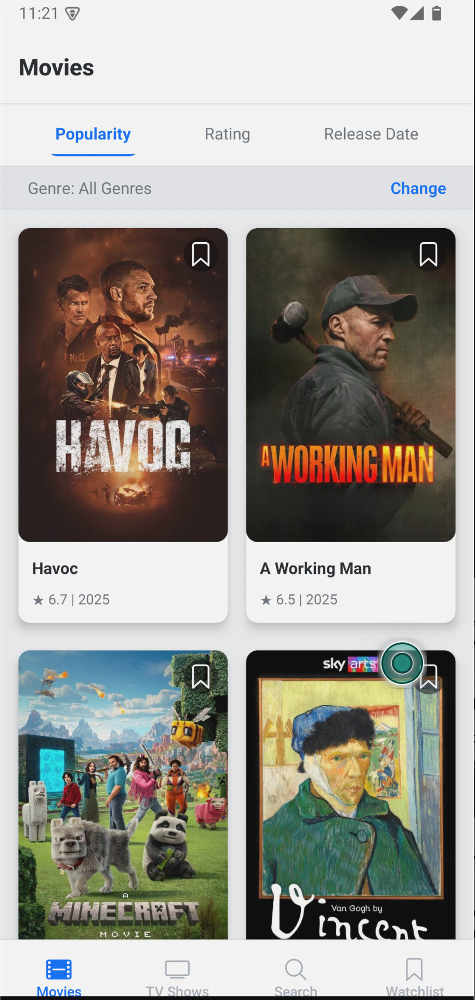

# 🎬 Movie & TV Show Explorer App

[](https://reactnative.dev/)
[](https://expo.dev/)
[](https://www.typescriptlang.org/)

A feature-rich mobile application that lets you discover popular movies and TV shows, search for content, view detailed information including where to watch, and maintain a personal watchlist - all in one place.

## ✨ Features

### Discover Content
- 🔍 Browse popular and top-rated Movies and TV Shows in separate tabs
- 🔄 Sort content by popularity, rating, or release date
- 🏷️ Filter content by genre
- 📱 Responsive grid layout for optimal viewing

### Search & Details
- 🔎 Search for movies and TV shows by title
- 📋 View comprehensive details including synopsis, ratings, release dates, and genres
- ⏱️ See runtime for movies and number of seasons for TV shows
- 🎭 Check content status (e.g., "Released", "In Production")

### Watch Options
- 📺 See where to stream, rent, or buy content (powered by JustWatch via TMDB)
- 🌎 Region-specific watch provider information

### Personalization
- 🔖 Add/remove content to a persistent watchlist
- 💾 Locally stored watchlist that persists between app sessions
- 🌓 Automatic dark/light theme based on system preferences

### User Experience
- ⏳ Loading states with visual feedback
- ↻ Pull-to-refresh for content lists
- 📱 Optimized for both iOS and Android

## 📱 Screenshots

> **Note:** Add your app screenshots here for better visualization.

<table>
  <tr>
    <td><strong>Home Screen</strong></td>
  </tr>
  <tr>
    <td></td>
  </tr>
</table>

## 🛠️ Technology Stack

- **[React Native](https://reactnative.dev/)** (v0.76.8): Core framework for building the mobile application
- **[Expo](https://expo.dev/)** (v52.0.42): Development platform and toolchain for React Native
- **[TypeScript](https://www.typescriptlang.org/)** (v5.3.3): Static typing for JavaScript
- **[React Navigation](https://reactnavigation.org/)** (v7.x): Navigation library for tab and stack navigation
- **[AsyncStorage](https://react-native-async-storage.github.io/async-storage/)**: Data storage solution for persisting the watchlist
- **[The Movie Database (TMDB) API](https://www.themoviedb.org/documentation/api)**: Data source for movies and TV shows

## 📁 Project Structure

```
├── src/
│   ├── api/              # API service logic (TMDB API integration)
│   ├── assets/           # Static assets (images, fonts)
│   ├── components/       # Reusable UI components
│   ├── constants/        # Application constants (API keys, URLs)
│   ├── context/          # React Context for state management
│   ├── hooks/            # Custom React hooks
│   ├── navigation/       # Navigation configuration
│   ├── screens/          # Screen components
│   ├── services/         # Business logic services
│   ├── styles/           # Global styles and themes
│   └── types/            # TypeScript type definitions
├── App.tsx               # Application entry point
├── app.json              # Expo configuration
└── package.json          # Dependencies and scripts
```

## 🚀 Installation and Setup

### Prerequisites
- [Node.js](https://nodejs.org/) (v16 or newer)
- [npm](https://www.npmjs.com/) or [Yarn](https://yarnpkg.com/)
- [Expo CLI](https://docs.expo.dev/workflow/expo-cli/)
- [TMDB API Key](https://www.themoviedb.org/documentation/api) (free to register)

### Getting Started

1. **Clone the repository**
   ```bash
   git clone https://github.com/yourusername/movie-explorer-app.git
   cd movie-explorer-app
   ```

2. **Install dependencies**
   ```bash
   npm install
   # or
   yarn install
   ```

3. **Set up environment variables**
   - Create a file named `src/constants/api.ts` with your TMDB API key:
   ```typescript
   export const TMDB_API_KEY = 'your_tmdb_api_key_here';
   export const TMDB_BASE_URL = 'https://api.themoviedb.org/3';
   ```

4. **Start the development server**
   ```bash
   npm start
   # or
   yarn start
   ```

5. **Run on a device or emulator**
   - Scan the QR code with the Expo Go app on your device
   - Press 'a' for Android emulator
   - Press 'i' for iOS simulator

## 📱 Usage

### Navigation
- Use the bottom tab navigator to switch between Movies, TV Shows, Search, and Watchlist
- Tap on any movie or TV show card to view its details
- Pull down on any list to refresh the content

### Discovering Content
- Browse popular movies and TV shows on their respective tabs
- Use the sort options at the top to sort by popularity, rating, or release date
- Tap on the genre selector to filter content by specific genres
- Scroll down to load more content

### Searching
- Navigate to the Search tab
- Enter your search query in the search bar
- Results will display as you type, showing both movies and TV shows
- Tap on any result to view details

### Managing Your Watchlist
- Tap the bookmark icon on any movie or TV show card to add it to your watchlist
- Navigate to the Watchlist tab to view all saved items
- Tap the bookmark icon again to remove an item from your watchlist
- Your watchlist is saved locally and will persist between app sessions

## 🔑 API Information

This app uses [The Movie Database (TMDB) API](https://www.themoviedb.org/documentation/api) to fetch movie and TV show data.

### Getting a TMDB API Key
1. Create a free account on [TMDB](https://www.themoviedb.org/signup)
2. Once logged in, go to your [account settings](https://www.themoviedb.org/settings/api)
3. Request an API key for developer use
4. Use this key in the app configuration as described in the Installation section

### API Usage Notes
- The free TMDB API has rate limits (approximately 3-4 requests per second)
- This app implements efficient API calls to stay within these limits
- The app uses the following TMDB endpoints:
  - `/movie/popular` and `/tv/popular` for popular content
  - `/movie/top_rated` and `/tv/top_rated` for top-rated content
  - `/search/multi` for searching across movies and TV shows
  - `/movie/{id}` and `/tv/{id}` for detailed information
  - `/movie/{id}/watch/providers` and `/tv/{id}/watch/providers` for streaming options

## 🤝 Contributing

Contributions are welcome! Here's how you can help improve this project:

1. **Fork the repository**
2. **Create a feature branch**
   ```bash
   git checkout -b feature/amazing-feature
   ```
3. **Make your changes**
4. **Commit your changes**
   ```bash
   git commit -m 'Add some amazing feature'
   ```
5. **Push to the branch**
   ```bash
   git push origin feature/amazing-feature
   ```
6. **Open a Pull Request**

### Development Guidelines
- Follow the existing code style and organization
- Write clean, maintainable, and testable code
- Update documentation for any new features or changes
- Test your changes thoroughly on both iOS and Android

## 📄 License

This project is licensed under the MIT License - see the [LICENSE](LICENSE) file for details.

## 🙏 Acknowledgments

- [The Movie Database (TMDB)](https://www.themoviedb.org/) for providing the API
- [JustWatch](https://www.justwatch.com/) for the streaming provider data (via TMDB)
- [React Native](https://reactnative.dev/) and [Expo](https://expo.dev/) communities for their excellent documentation and support
